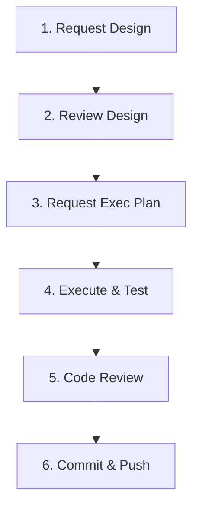

# Getting Started with the AI Agent Harness

This guide helps developers and AI agents onboard to the Android Browser Helper Agent Harness.

## How to Onboard & Run the Project Agent

Because the `.agents/` configuration directory is local and gitignored, you must set it up once in your workspace root to make the skills and agents discoverable.

### 1. Register Skills
Create (or update) `.agents/skills.json` in your workspace root to inherit the project's custom skills:

```json
{
  "inherits": [
    {
      "path": "_agents/skills.json"
    }
  ]
}
```

### 2. Register Agents
Create (or update) `.agents/agents.json` in your workspace root to inherit the project's custom agents:

```json
{
  "inherits": [
    {
      "path": "_agents/agents.json"
    }
  ]
}
```

### 3. Launch the Agent
Once registered, start a session selecting the **`android-browser-helper_agent`** as the main agent. This ensures the agent has the project's specific rules and system prompts loaded as its core identity.

---

## Intended Developer Workflow

When working with the AI agent, follow this structured loop:



### 1. Design Generation
*   **Prompt**: `Write a design document for [feature description]`
*   **Action**: The agent invokes the `doc-writer` skill. It drafts a technical design in `_agents/designs/` and runs it through an internal adversarial review loop (using `adversarial_reviewer` subagent) before presenting the draft to you.

### 2. Design Review (On-Demand)
*   **Prompt**: `Run a design review on _agents/designs/0001-my-design.md`
*   **Action**: Invokes the `review` skill. The `adversarial_reviewer` subagent acts as a **Skeptical Architect**, critiquing the design for security, compatibility, and stability risks based on [`_agents/rules/REVIEWS.md`](rules/REVIEWS.md).

### 3. Execution Planning
*   **Prompt**: `Create an execution plan based on the design _agents/designs/0001-my-design.md`
*   **Action**: The agent drafts a step-by-step implementation plan (e.g., `_agents/plans/0001-my-plan.md`) detailing the exact file modifications and testing strategies required.

### 4. Implementation & Testing
*   **Prompt**: `Implement the changes in the execution plan _agents/plans/0001-my-plan.md`
*   **Action**: The `android-browser-helper_agent` applies the code changes, compiles locally using Gradle, and runs the target unit/instrumentation tests as defined in [`_agents/rules/TESTING.md`](rules/TESTING.md).

### 5. Local Code Review
*   **Prompt**: `Review my local changes`
*   **Action**: Invokes the `code-review` skill. The `reviewer` agent analyzes your git diff, checks it against the project's style guide and checklists, and outputs a "Dashboard-First" report.

### 6. Commit & Push
*   **Prompt**: `Commit my changes`
*   **Action**: The agent commits the staged changes with a structured description (including `TAG=agy` and `CONV=`).

---

## Agent Environment Setup

For AI agents running in this workspace, the harness is integrated via the `.agents/` directory:
*   **Active Rules**: Always read [`AGENTS.md`](../AGENTS.md) first to load the project rules.
*   **Routing Table**: Use [`RULES.md`](RULES.md) to locate specific guidelines.
